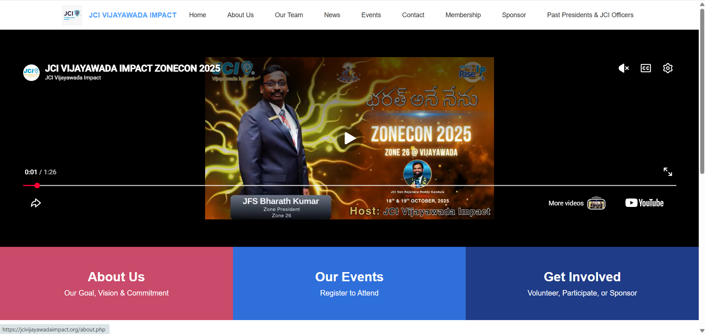
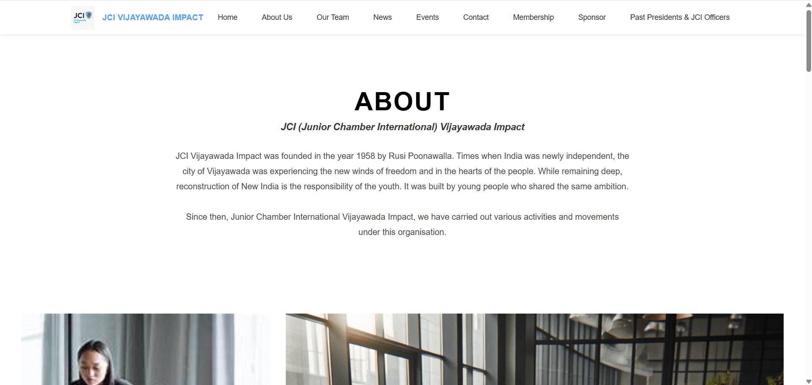
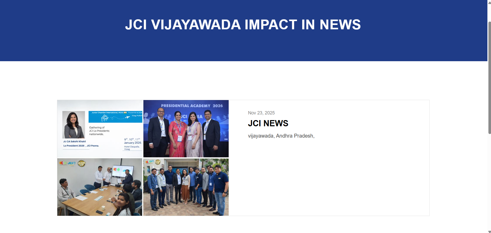
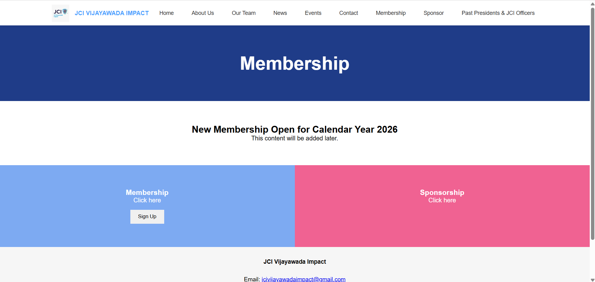
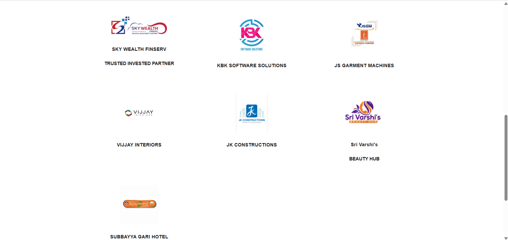
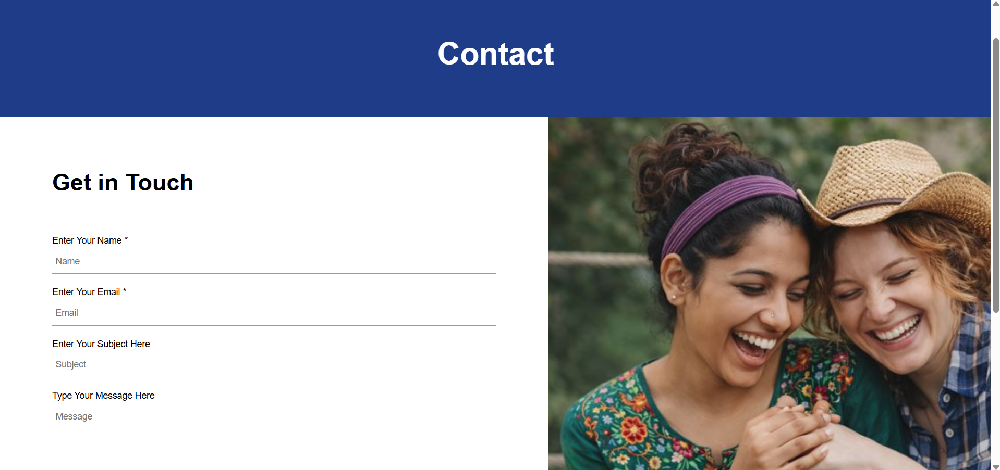

# Community Organization Website

A responsive **PHP & MySQL** web application developed as a **freelance client project** for a community organization. The website provides a modern digital platform to showcase organizational information, leadership, events, news, sponsorship opportunities, membership details, and contact information.

This project demonstrates practical experience in building a real-world multi-page website using modular PHP architecture, reusable components, and responsive front-end development.

---

## ✨ Project Highlights

- Responsive multi-page website
- Modular PHP architecture
- Dynamic event management pages
- News & announcements section
- Sponsor showcase
- Membership information page
- Contact form
- Admin authentication module
- Reusable layout components
- Mobile-friendly design
- Live deployment experience

---

## 🛠️ Tech Stack

| Technology | Purpose |
|------------|---------|
| PHP | Backend Development |
| MySQL | Database |
| HTML5 | Structure |
| CSS3 | Styling |
| JavaScript | Client-side Interactions |
| XAMPP | Local Development |
| Git | Version Control |
| GitHub | Source Code Management |

---

# Project Structure

```text
community-organization-website
│
├── admin/
│
├── config/
│   └── db.php
│
├── images/
│
├── screenshots/
│
├── index.php
├── home.php
├── about.php
├── events.php
├── event-details.php
├── news.php
├── sponsor.php
├── contact.php
├── login.php
├── login_process.php
├── navbar.php
├── footer.php
├── head.php
└── style.css
```

---

# Features

### Public Website

- Home Page
- About Organization
- News Section
- Events Listing
- Event Details
- Sponsor Showcase
- Membership Information
- Contact Page

### Administration

- Admin Login
- Protected Admin Dashboard
- Event Management
- News Management

---

# Screenshots

## Home



---

## About



---

## News



---

## Membership



---

## Sponsors



---

## Contact



---

# Getting Started

## Clone the Repository

```bash
git clone https://github.com/sujani-yalla/community-organization-website.git
```

## Local Setup

1. Install XAMPP.
2. Copy the project into:

```text
xampp/htdocs/
```

3. Create a MySQL database.

4. Update database credentials inside:

```text
config/db.php
```

5. Start Apache and MySQL.

6. Open:

```text
http://localhost/community-organization-website/
```

---

# Repository Notice

This repository is shared as part of my professional portfolio to demonstrate my web development skills.

The original SQL database is **not included**, as the local database backup was lost after a development environment reset.

Screenshots represent the publicly deployed website developed for the client. Client branding remains visible in the screenshots because they were captured from the live deployment.

---

# Project Status

**Freelance Client Project**

- Public website substantially completed
- Administrative module partially implemented
- Development concluded before the project reached full completion

This repository is maintained as a portfolio project showcasing practical PHP and MySQL development experience.

---

# Skills Demonstrated

- PHP Development
- MySQL Integration
- Modular Application Design
- Responsive Web Design
- Authentication
- CRUD Operations
- Website Deployment
- Git Version Control
- GitHub Repository Management

---

# Learning Outcomes

Through this project, I gained practical experience in:

- Developing a complete PHP website
- Structuring real-world web applications
- Building reusable PHP components
- Connecting PHP with MySQL
- Deploying websites to live hosting
- Managing source code using Git & GitHub
- Working on a freelance client project from development to deployment

---

# Author

**Sujani Yalla**

B.Tech – Artificial Intelligence & Data Science

Passionate about AI, Web Development, Workflow Automation, and building practical software solutions.

---

⭐ If you found this repository interesting, consider giving it a star.
